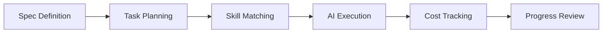
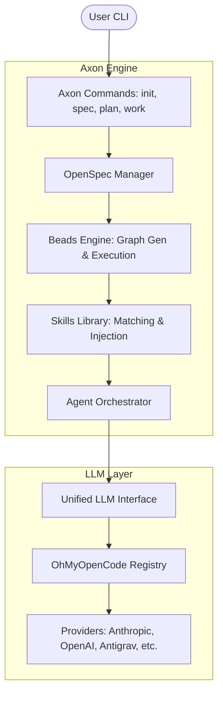

# Axon

> 🧠 AI-Powered Development Operating System

[中文文档](./README.zh-CN.md) | [Documentation](./docs) | [Contributing](./CONTRIBUTING.md)

[](./LICENSE)
[](https://bun.sh)
[](https://www.typescriptlang.org)

Axon is a unified AI-assisted development environment that solves context loss, wheel reinvention, and planning chaos in AI-powered programming. **Powered by [OpenCode](https://github.com/anomalyco/opencode) and [OhMyOpenCode](https://github.com/code-yeongyu/oh-my-opencode)**, Axon orchestrates these powerful tools through specification-driven development and task management.

## ✨ Why Axon?

**Axon transforms AI from a "Code Autocompleter" into a "Development Partner".**

- **🧠 Spec-First**: Don't just chat. Define requirements in `spec.md` to keep the AI focused.
- **🗺️ Bead Planning**: Complex features are broken into atomic, dependency-sorted tasks (Beads).
- **🤖 Agentic Execution**: **OpenCode** agents execute tasks one-by-one, ensuring context and quality.
- **♻️ Skill Reuse**: Automatically apply proven patterns (e.g., "Secure Auth") from your team's library.
- **🛡️ Enterprise Safe**: Token budgeting, Git safety checks, and multi-provider failover via **OMO**.

## 🎯 Applicable Scenarios

Axon is best suited for:

- **Complex Feature Implementation**: When a feature requires multiple file changes and architectural consistency (e.g., "Add JWT Auth").
- **Greenfield Projects**: Starting a new project with clear requirements and strictly following a spec.
- **Large-Scale Refactoring**: Systematically updating code patterns across a codebase.
- **Team Standardization**: Enforcing consistent coding standards and capabilities across a team using shared Skill templates.

It is **NOT** designed for:
- Simple, one-line code completions (Use Copilot/Cursor).
- Real-time syntax error fixing (Use IDE linters).

## 🆚 Tool Comparison

| Feature | Axon | GitHub Copilot / Cursor | Aider / OpenDevin |
| :--- | :--- | :--- | :--- |
| **Core Philosophy** | **Plan-Execute-Verify** (Agentic) | **Autocomplete** (Assistive) | **Chat-to-Code** (Autonomous) |
| **Context Awareness** | **High** (Project-wide Spec + Graph) | **Medium** (Open Files + RAG) | **High** (Repo Map) |
| **Planning** | ✅ **Pre-execution Task Graph** | ❌ None (Streaming) | ⚠️ Implicit (Step-by-step) |
| **Human Control** | ✅ **High** (Review Plan & Spec) | ✅ High (Accept/Reject) | ⚠️ Application Dependent |
| **Cost Control** | ✅ **Token Budgeting & Tracking** | ❌ Subscription Based | ⚠️ Often Unbounded |
| **Knowledge Reuse** | ✅ **Skill Templates** (.skills) | ❌ None | ❌ None |

## 🚀 Quick Start

### Global Installation (Recommended)

```bash
# Install globally via npm
npm install -g @arrislink/axon

# Or use with bunx
bunx @arrislink/axon init my-project
```

### Development Installation

```bash
# Clone the repository
git clone https://github.com/arrislink/axon.git
cd axon

# Install dependencies
bun install

# Link locally for global access
npm link

# Verify installation
ax --help
```

### Initialize Your First Project

```bash
# Create a new project
ax init my-awesome-project
cd my-awesome-project

# Create specification interactively
ax spec init

# Generate task graph from spec
ax plan

# Start working on tasks
ax work

# Check project status
ax status
```

## 📚 Core Concepts

### Workflow



### Directory Structure

```
.axon/
├── config.yaml          # Project configuration
└── logs/               # Execution logs

.openspec/
└── spec.md             # Project specification

.beads/
└── graph.json          # Task dependency graph

.skills/
└── local/              # Project-specific skills
```

## 🛠️ Commands

| Command | Description |
|---------|-------------|
| `ax init [name]` | Initialize a new Axon project |
| `ax spec init` | Create project specification interactively |
| `ax spec show` | Display current specification |
| `ax plan` | Generate task graph from specification |
| `ax work` | Execute the next task |
| `ax work --interactive` | Execute tasks in interactive mode |
| `ax skills search <query>` | Search for skill templates |
| `ax skills add <path>` | Add a new skill template |
| `ax status` | View project progress |
| `ax doctor` | Diagnose environment issues |

## ⚙️ Configuration

### LLM Provider Configuration

Axon integrates with [OhMyOpenCode (OMO)](https://github.com/code-yeongyu/oh-my-opencode) for seamless multi-provider support:

```bash
# Configure OMO (optional for enhanced features)
bunx oh-my-opencode install
omo config set-provider antigravity

# Axon automatically detects and uses OMO configuration
ax plan  # Uses configured provider
```

**Provider Priority:**
1. **CLI Mode** - Uses OpenCode CLI (inherits full OMO capabilities)
2. **Direct Mode** - Reads OMO config, calls APIs directly
3. **Fallback Mode** - Uses `ANTHROPIC_API_KEY` environment variable

### Environment Variables

```bash
# Required (fallback mode)
ANTHROPIC_API_KEY=sk-ant-...

# Optional (additional providers)
OPENAI_API_KEY=sk-...
GOOGLE_API_KEY=...
```

### Project Configuration

Edit `.axon/config.yaml`:

```yaml
version: "1.0"

project:
  name: "my-project"
  description: "Project description"

agents:
  sisyphus:
    model: "claude-sonnet-4-20250514"
    provider: "anthropic"
    temperature: 0.7
    max_tokens: 8000

safety:
  daily_token_limit: 1000000
  cost_alert_threshold: 10.0
  auto_pause_on_error: true
```

## 🏗️ Architecture

Axon is built on a modular architecture that separates requirement definition, task planning, and agentic execution.



### Core Components:

1.  **OpenSpec Manager**: Parses and manages the specification (`.openspec/spec.md`). It ensures the AI always has a "Source of Truth" for requirements.
2.  **Beads Engine**: 
    *   **Planning**: Converts specifications into a Directed Acyclic Graph (DAG) of atomic tasks.
    *   **Execution**: Manages task dependencies, state persistence (`graph.json`), and sequential execution.
3.  **Skills Library**: A repository of reusable code patterns. It automatically matches relevant skills to tasks and injects them into the agent's context.
4.  **Agent Orchestrator**: Coordinates specialized AI agents (like the general-purpose "Sisyphus") to execute specific beads.
5.  **Unified LLM Interface**: A vendor-neutral abstraction layer that integrates with **OhMyOpenCode** to provide multi-provider failover and consistent API access.

---

## 🧪 Development

### Running Tests

```bash
# Run all tests
bun test

# Type checking
bun run type-check

# Linting and formatting
bun run lint
```

### Building

```bash
# Build compiled binary
bun run build

# Build JavaScript output
bun run build:js
```

## 📖 Documentation
 
- [**User Guide**](./docs/GUIDE.md) - **Start Here** (Philosophy, Arch, Features, API)
- [Contributing Guide](./CONTRIBUTING.md)
- [Changelog](./CHANGELOG.md)

## 🤝 Contributing

Contributions are welcome! Please read our [Contributing Guide](./CONTRIBUTING.md) for details on our code of conduct and the process for submitting pull requests.

## 📄 License

This project is licensed under the MIT License - see the [LICENSE](./LICENSE) file for details.

## 🙏 Acknowledgments

- [OpenSpec](https://github.com/Fission-AI/OpenSpec) - Specification format
- [OhMyOpenCode](https://github.com/code-yeongyu/oh-my-opencode) - Multi-provider LLM integration
- [OpenCode](https://github.com/anomalyco/opencode) - AI coding agent core
- [FindSkills](https://skills.sh/) - Skill discovery and management
- [Beads](https://github.com/steveyegge/beads) - Distributed task graph system
- [Anthropic](https://anthropic.com) - Claude AI models
- [Bun](https://bun.sh) - Fast all-in-one JavaScript runtime

## 📮 Support

- 📧 Email: gocoder@hotmail.com
- 🐛 Issues: [GitHub Issues](https://github.com/arrislink/axon/issues)

---

Made with 🧠 by the Axon Team
