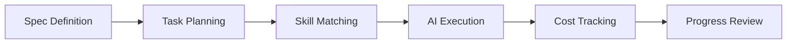
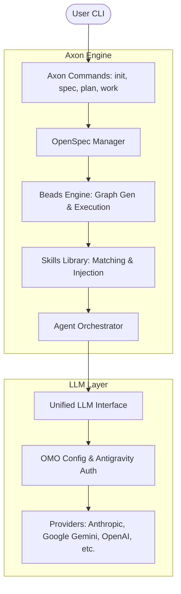

# Axon

> 🧠 AI-Powered Development Operating System

[中文文档](./README.zh-CN.md) | [Documentation](./docs) | [Contributing](./CONTRIBUTING.md)

[](./LICENSE)
[](https://bun.sh)
[](https://www.typescriptlang.org)

Axon is a unified AI-assisted development environment that solves context loss, wheel reinvention, and planning chaos in AI-powered programming. **Powered by [OpenCode](https://github.com/anomalyco/opencode) and [OhMyOpenCode](https://github.com/code-yeongyu/oh-my-opencode)**, Axon orchestrates these powerful tools through specification-driven development and task management.

## ✨ Why Axon?

**Axon transforms AI from a "Code Autocompleter" into a "Development Partner".**

- **🧠 Spec-First**: Don't just chat. Define requirements in `spec.md` to keep the AI focused.
- **🗺️ Bead Planning**: Complex features are broken into atomic, dependency-sorted tasks (Beads).
- **🔄 Full Flow**: One-click orchestration from requirements to verification using `ax flow run`.
- **🔌 IDE Ready**: Integrate with Cursor/Trae/VSCode via **MCP** (Model Context Protocol).
- **🤖 Agentic Execution**: **OpenCode** agents execute tasks one-by-one, ensuring context and quality.
- **🛡️ Quality Guard**: Automated `run_checks` and generated `VERIFY.md` reports for every milestone.
- **♻️ Skill Reuse**: Automatically apply proven patterns (e.g., "Secure Auth") from your team's library.
- **📚 Document Integration**: Import PDF/Word/MD docs as context for AI to generate specs and code using `ax docs`.
- **🚀 Skill Orchestration**: Automatically detect tech stacks (React, Go, PHP) and suggest relevant expertise.
- **🛡️ Enterprise Safe**: Path sandboxing, Git safety checks, and multi-provider failover via **OMO**.

## 🎯 Applicable Scenarios

Axon is best suited for:

- **Complex Feature Implementation**: When a feature requires multiple file changes and architectural consistency (e.g., "Add JWT Auth").
- **Greenfield Projects**: Starting a new project with clear requirements and strictly following a spec.
- **Large-Scale Refactoring**: Systematically updating code patterns across a codebase.
- **Team Standardization**: Enforcing consistent coding standards and capabilities across a team using shared Skill templates.

It is **NOT** designed for:
- Simple, one-line code completions (Use Copilot/Cursor).
- Real-time syntax error fixing (Use IDE linters).

## 🆚 Tool Comparison

Note: capabilities vary by product version and configuration; this table reflects common defaults and emphasis.

Also note the abstraction level:
- **Axon** is a workflow/orchestration layer (spec, planning graph, execution, verification).
- **OpenCode** is the underlying agent execution engine.
- **OhMyOpenCode (OMO)** is the provider layer for connecting to different LLM backends/accounts.

| Feature | Axon | GitHub Copilot / Cursor | Aider / OpenDevin |
| :--- | :--- | :--- | :--- |
| **Core Philosophy** | **Spec/Plan/Work/Verify** (workflow-first) | **IDE assistant** (chat + completions) | **Agent-driven coding** (chat + patches/tools) |
| **Context Awareness** | **Persisted artifacts** (`.openspec` + `.beads`) | **Workspace context** (open files + index/RAG, varies) | **Repo context** (repo map/tools, varies) |
| **Planning** | ✅ **Explicit task graph** (Beads) | ⚠️ **Ad-hoc** (chat planning; no shared graph by default) | ⚠️ **Tool-dependent** (can follow plans; some have planning) |
| **Human Control** | ✅ **High** (reviewable docs/graph + git safety) | ✅ **High** (accept/reject + manual edits) | ⚠️ **Mode-dependent** (git-based review; autonomy optional) |
| **Cost Control** | ✅ **Usage tracking** (limits if configured/provider supports) | ⚠️ **Provider/subscription** (quotas vary) | ⚠️ **Provider-dependent** (budgets need explicit guardrails) |
| **Knowledge Reuse** | ✅ **Skills templates** (`.skills`) | ⚠️ **Rules/prompts** (workspace/user; less structured) | ⚠️ **Prompts/scripts** (reuse possible; tool-dependent) |

## 🚀 Quick Start

### First-time LLM setup (Recommended)

Axon can run in different LLM modes depending on your workflow:
- **IDE-owned LLM**: run `ax mcp --llm off` and let Cursor/Trae handle model calls (Axon focuses on spec/plan/verify artifacts).
- **OMO + OpenCode CLI**: install/configure OMO, then run `ax config test` and (optionally) `ax config set-model <model> -p <provider>` to persist project defaults in `.axon/config.yaml`.
- **Fallback (env vars)**: set `ANTHROPIC_API_KEY` (or `OPENAI_API_KEY` / `GOOGLE_API_KEY`), then run `ax config test --mode fallback`.

### Global Installation (Recommended)

```bash
# Install globally via npm
npm install -g @arrislink/axon

# Or use with bunx
bunx @arrislink/axon init my-project
```

### Development Installation

```bash
# Clone the repository
git clone https://github.com/arrislink/axon.git
cd axon

# Install dependencies
bun install

# Link locally for global access
npm link

# Verify installation
ax --help
```

### Initialize Your First Project

```bash
# Create a new project
ax init my-awesome-project
cd my-awesome-project

# Create specification interactively (or from docs)
ax docs add-dir ./docs          # Scan and import all documents
ax spec init                    # AI uses imported docs to generate spec
ax spec analyze                 # Refine spec into professional PRD.md

# Generate task graph from spec
ax plan
...
...
# Check project status
ax status
```

## ✅ Best Practices (Short)
- Prefer `ax flow run` for a deterministic Spec → Plan → Work → Verify loop.
- Use `ax mcp --llm off` for IDE-first workflows; use `--llm auto` for automation.
- Keep `.openspec/` and `.beads/` committed for team/CI repeatability.

More playbooks and examples: [GUIDE.md](./docs/GUIDE.md).

## 📚 Core Concepts

### Workflow



### Directory Structure

```
.axon/
├── config.yaml          # Project configuration
└── logs/               # Execution logs

.openspec/
└── spec.md             # Project specification

.beads/
└── graph.json          # Task dependency graph

.skills/
└── *.md                # Project-specific skills (default; configurable)
```

## 🛠️ Commands

| Command | Description |
|---------|-------------|
| `ax init [name]` | Initialize a new Axon project |
| `ax flow run` | Run full automated workflow (Spec -> Plan -> Work -> Verify) |
| `ax mcp` | Start MCP server for IDE integration (Cursor/Trae/VSCode) |
| `ax spec init` | Create project specification interactively |
| `ax spec analyze` | Refine specification into professional PRD.md |
| `ax docs add <file>` | Import document (PDF, Word, MD) into project |
| `ax docs add-dir [dir]` | Import all documents in a directory (defaults to ./docs) |
| `ax plan` | Generate task graph from specification |
| `ax work` | Execute the next task |
| `ax status` | View project progress and diagnostics |
| `ax doctor` | Diagnose environment issues |
| `ax skills find [query]` | Find official skills from skills.sh |
| `ax skills install <owner/repo@skill>` | Install skill into this project |
| `ax clean --clutter` | Clean redundant agent folders (.claude/.cursor/...) |

## ⚙️ Configuration

For a first-time setup checklist, see [GUIDE.md](./docs/GUIDE.md).

### LLM Provider Configuration

Axon integrates with [OhMyOpenCode (OMO)](https://github.com/code-yeongyu/oh-my-opencode) for seamless multi-provider support:

```bash
# Configure OMO (optional for enhanced features)
bunx oh-my-opencode install
omo config set-provider antigravity

# Axon automatically detects and uses OMO configuration
ax plan  # Uses configured provider
```

**Provider Priority:**
1. **CLI Mode** - Uses OpenCode CLI (inherits full OMO capabilities)
2. **Direct Mode** - Reads OMO config and resolves **Antigravity** tokens automatically
3. **Fallback Mode** - Uses `ANTHROPIC_API_KEY` etc. environment variables

### Environment Variables

```bash
# Required (fallback mode)
ANTHROPIC_API_KEY=sk-ant-...

# Optional (additional providers)
OPENAI_API_KEY=sk-...
GOOGLE_API_KEY=...
```

### Project Configuration

Edit `.axon/config.yaml`:

```yaml
version: "1.0"

project:
  name: "my-project"
  description: "Project description"

agents:
  sisyphus:
    model: "claude-sonnet-4-20250514"
    provider: "anthropic"
    temperature: 0.7
    max_tokens: 8000

safety:
  daily_token_limit: 1000000
  cost_alert_threshold: 10.0
  auto_pause_on_error: true
```

## 🏗️ Architecture

Axon is built on a modular architecture that separates requirement definition, task planning, and agentic execution.



### Core Components:

1.  **OpenSpec Manager**: Parses and manages the specification (`.openspec/spec.md`). It ensures the AI always has a "Source of Truth" for requirements.
2.  **Beads Engine**: 
    *   **Planning**: Converts specifications into a Directed Acyclic Graph (DAG) of atomic tasks.
    *   **Execution**: Manages task dependencies, state persistence (`graph.json`), and sequential execution.
3.  **Skills Library**: A repository of reusable code patterns. It automatically matches relevant skills to tasks and injects them into the agent's context.
4.  **Agent Orchestrator**: Coordinates specialized AI agents (like the general-purpose "Sisyphus") to execute specific beads.
5.  **Unified LLM Interface**: A vendor-neutral abstraction layer that integrates with **OhMyOpenCode** to provide multi-provider failover and consistent API access.

---

## 🧪 Development

### Running Tests

```bash
# Run all tests
bun test

# Type checking
bun run type-check

# Linting and formatting
bun run lint
```

### Building

```bash
# Build compiled binary
bun run build

# Build JavaScript output
bun run build:js
```

## 📖 Documentation
 
- [**User Guide**](./docs/GUIDE.md) - **Start Here** (Quick Start + Features)
- [Contributing Guide](./CONTRIBUTING.md)
- [Changelog](./CHANGELOG.md)

## 🤝 Contributing

Contributions are welcome! Please read our [Contributing Guide](./CONTRIBUTING.md) for details on our code of conduct and the process for submitting pull requests.

## 📄 License

This project is licensed under the MIT License - see the [LICENSE](./LICENSE) file for details.

## 🙏 Acknowledgments

- [OpenSpec](https://github.com/Fission-AI/OpenSpec) - Specification format
- [OhMyOpenCode](https://github.com/code-yeongyu/oh-my-opencode) - Multi-provider LLM integration
- [OpenCode](https://github.com/anomalyco/opencode) - AI coding agent core
- [FindSkills](https://skills.sh/) - Skill discovery and management
- [Beads](https://github.com/steveyegge/beads) - Distributed task graph system
- [Anthropic](https://anthropic.com) - Claude AI models
- [Bun](https://bun.sh) - Fast all-in-one JavaScript runtime

## 📮 Support

- 📧 Email: gocoder@hotmail.com
- 🐛 Issues: [GitHub Issues](https://github.com/arrislink/axon/issues)

---

Made with 🧠 by the Axon Team
