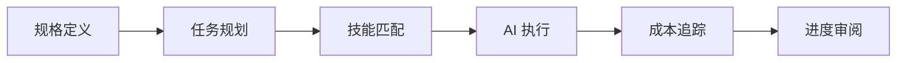

# Axon

> 🧠 AI 驱动的开发操作系统

[English](./README.md) | [文档](./docs) | [贡献指南](./CONTRIBUTING.md)

[](./LICENSE)
[](https://bun.sh)
[](https://www.typescriptlang.org)

Axon 是一个统一的 AI 辅助开发环境，通过深度集成规格驱动开发、任务管理和技能复用，解决 AI 编程中的上下文丢失、重复造轮子和规划失控问题。

## ✨ 核心特性

- **📝 规格驱动开发** - 先定义清晰需求，再编码
- **🔗 任务可追溯性** - 每行代码对应明确的任务珠子
- **🎯 知识复用** - 自动匹配并应用已验证的技能模板
- **💰 成本控制** - 智能追踪 token 消耗，避免超支
- **🤖 多提供商支持** - 集成 OMO，支持 75+ LLM 提供商（Anthropic、OpenAI、Antigravity 等）
- **🎭 Agent 编排** - 多个 AI 代理智能协作

## 🚀 快速开始

### 全局安装（推荐）

```bash
# 通过 npm 全局安装
npm install -g @arrislink/axon

# 或使用 bunx
bunx @arrislink/axon init my-project
```

### 开发安装

```bash
# 克隆仓库
git clone https://github.com/arrislink/axon.git
cd axon

# 安装依赖
bun install

# 本地链接以进行全局访问
npm link

# 验证安装
ax --help
```

### 初始化你的第一个项目

```bash
# 创建新项目
ax init my-awesome-project
cd my-awesome-project

# 交互式创建规格
ax spec init

# 从规格生成任务图
ax plan

# 开始执行任务
ax work

# 查看项目状态
ax status
```

## 📚 核心概念

### 工作流



### 目录结构

```
.axon/
├── config.yaml          # 项目配置
└── logs/               # 执行日志

.openspec/
└── spec.md             # 项目规格

.beads/
└── graph.json          # 任务依赖图

.skills/
└── local/              # 项目特定技能
```

## 🛠️ 命令

| 命令 | 描述 |
|------|------|
| `ax init [name]` | 初始化新的 Axon 项目 |
| `ax spec init` | 交互式创建项目规格 |
| `ax spec show` | 显示当前规格 |
| `ax plan` | 从规格生成任务图 |
| `ax work` | 执行下一个任务 |
| `ax work --interactive` | 交互模式执行任务 |
| `ax skills search <query>` | 搜索技能模板 |
| `ax skills add <path>` | 添加新技能模板 |
| `ax status` | 查看项目进度 |
| `ax doctor` | 诊断环境问题 |

## ⚙️ 配置

### LLM 提供商配置

Axon 与 [OhMyOpenCode (OMO)](https://github.com/code-yeongyu/oh-my-opencode) 集成，实现无缝的多提供商支持：

```bash
# 配置 OMO（可选，用于增强功能）
bunx oh-my-opencode install
omo config set-provider antigravity

# Axon 自动检测并使用 OMO 配置
ax plan  # 使用配置的提供商
```

**提供商优先级:**
1. **CLI 模式** - 使用 OpenCode CLI（继承 OMO 全部能力）
2. **直接模式** - 读取 OMO 配置，直接调用 API
3. **回退模式** - 使用 `ANTHROPIC_API_KEY` 环境变量

### 环境变量

```bash
# 必需（回退模式）
ANTHROPIC_API_KEY=sk-ant-...

# 可选（其他提供商）
OPENAI_API_KEY=sk-...
GOOGLE_API_KEY=...
```

### 项目配置

编辑 `.axon/config.yaml`:

```yaml
version: "1.0"

project:
  name: "my-project"
  description: "项目描述"

agents:
  sisyphus:
    model: "claude-sonnet-4-20250514"
    provider: "anthropic"
    temperature: 0.7
    max_tokens: 8000

safety:
  daily_token_limit: 1000000
  cost_alert_threshold: 10.0
  auto_pause_on_error: true
```

## 🏗️ 架构

```
┌─────────────────────────────────────────────────────┐
│              Axon (编排层)                           │
│  ┌──────────┬──────────┬──────────┬──────────┐     │
│  │  init    │  spec    │  plan    │  work    │     │
│  └──────────┴──────────┴──────────┴──────────┘     │
└─────────────────────────────────────────────────────┘
                        ↓
┌─────────────────────────────────────────────────────┐
│         统一 LLM 接口 (LLMClient)                    │
│  自动检测并使用 OMO Provider 系统                    │
└─────────────────────────────────────────────────────┘
                        ↓
┌─────────────────────────────────────────────────────┐
│      OhMyOpenCode Provider 系统 (可选)               │
│  ┌──────────┬──────────┬──────────┬──────────┐     │
│  │Anthropic │Antigrav  │  OpenAI  │  Google  │     │
│  └──────────┴──────────┴──────────┴──────────┘     │
│  • 统一配置 (~/.omo/providers.yaml)                 │
│  • 自动 failover                                    │
│  • 成本优化                                         │
└─────────────────────────────────────────────────────┘
```

## 🧪 开发

### 运行测试

```bash
# 运行所有测试
bun test

# 类型检查
bun run type-check

# 代码检查和格式化
bun run lint
```

### 构建

```bash
# 构建编译后的二进制文件
bun run build

# 构建 JavaScript 输出
bun run build:js
```

## 📖 文档

- [产品需求文档 (PRD)](./PRD.md)
- [API 文档](./docs/api.md)
- [贡献指南](./CONTRIBUTING.md)
- [更新日志](./CHANGELOG.md)

## 🤝 贡献

欢迎贡献！详情请阅读我们的[贡献指南](./CONTRIBUTING.md)，了解行为准则和提交 PR 的流程。

## 📄 许可证

本项目采用 MIT 许可证 - 详见 [LICENSE](./LICENSE) 文件。

## 🙏 致谢

- [OpenSpec](https://github.com/Fission-AI/OpenSpec) - 规格格式
- [OhMyOpenCode](https://github.com/code-yeongyu/oh-my-opencode) - 多提供商 LLM 集成
- [OpenCode](https://github.com/anomalyco/opencode) - AI 编程智能体核心
- [FindSkills](https://skills.sh/) - 技能发现与管理
- [Beads](https://github.com/steveyegge/beads) - 分布式任务图系统
- [Anthropic](https://anthropic.com) - Claude AI 模型
- [Bun](https://bun.sh) - 快速的一体化 JavaScript 运行时

## 📮 支持

- 📧 邮箱: support@axon.dev
- 💬 Discord: [加入我们的社区](https://discord.gg/axon)
- 🐛 问题: [GitHub Issues](https://github.com/arrislink/axon/issues)

---

用 🧠 制作，Axon 团队出品
