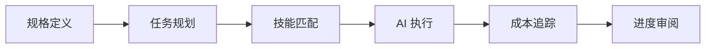
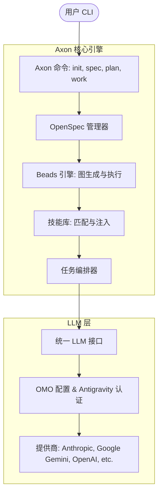

# Axon

> 🧠 AI 驱动的开发操作系统

[English](./README.md) | [文档](./docs) | [贡献指南](./CONTRIBUTING.md)

[](./LICENSE)
[](https://bun.sh)
[](https://www.typescriptlang.org)

Axon 是一个统一的 AI 辅助开发环境，解决 AI 编程中的上下文丢失、重复造轮子和规划失控问题。**由 [OpenCode](https://github.com/anomalyco/opencode) 和 [OhMyOpenCode](https://github.com/code-yeongyu/oh-my-opencode) 驱动**，Axon 通过规格驱动开发和任务管理来编排这些强大的工具。

## ✨ 为什么选择 Axon?

**Axon 将 AI 从“代码补全工具”转变为真正的“开发合作伙伴”。**

- **🧠 规格优先**: 拒绝随意对话。在 `spec.md` 中定义需求，让 AI 保持专注。
- **🗺️ 珠子规划**: 将复杂功能拆解为原子的、按依赖排序的任务 (Beads)。
- **🤖 代理执行**: **OpenCode** 智能体逐个执行任务，确保上下文完整和代码质量。
- **♻️ 技能复用**: 自动应用团队库中经过验证的模式 (如“安全认证”)。
- **📚 文档集成**: 导入 PDF/Word/MD 文档作为 AI 上下文，使用 `ax docs` 辅助生成规格和代码。
- **🛡️ 企业级安全**: Token 预算控制、Git 安全检查以及通过 **OMO** 实现的多模型故障转移。

## 🎯 适用场景

Axon 最适合以下场景：

- **复杂功能实现**: 当功能需要修改多个文件并保持架构一致性时（例如“添加 JWT 认证”）。
- **绿地项目**: 启动一个需求清晰且严格遵循规格的新项目。
- **大规模重构**: 在代码库中系统地更新代码模式。
- **团队标准化**: 使用共享的技能模板在团队中强制执行一致的编码标准和能力。

它是与 **不适用** 于：
- 简单的单行代码补全（请使用 Copilot/Cursor）。
- 实时语法错误修复（请使用 IDE linter）。

## 🆚 工具对比

| 特性 | Axon | GitHub Copilot / Cursor | Aider / OpenDevin |
| :--- | :--- | :--- | :--- |
| **核心理念** | **规划-执行-验证** (代理式) | **自动补全** (辅助式) | **聊天即代码** (自主式) |
| **上下文感知** | **高** (全项目规格 + 任务图) | **中** (打开文件 + RAG) | **高** (仓库地图) |
| **规划能力** | ✅ **执行前任务图** | ❌ 无 (流式生成) | ⚠️ 隐式 (逐步进行) |
| **人类控制** | ✅ **高** (审查规划与规格) | ✅ 高 (接受/拒绝) | ⚠️ 依赖于具体应用 |
| **成本控制** | ✅ **Token 预算与追踪** | ❌ 基于订阅 | ⚠️ 通常无限制 |
| **知识复用** | ✅ **技能模板** (.skills) | ❌ 无 | ❌ 无 |

## 🚀 快速开始

### 全局安装（推荐）

```bash
# 通过 npm 全局安装
npm install -g @arrislink/axon

# 或使用 bunx
bunx @arrislink/axon init my-project
```

### 开发安装

```bash
# 克隆仓库
git clone https://github.com/arrislink/axon.git
cd axon

# 安装依赖
bun install

# 本地链接以进行全局访问
npm link

# 验证安装
ax --help
```

### 初始化你的第一个项目

```bash
# 创建新项目
ax init my-awesome-project
cd my-awesome-project

# 交互式创建规格（或从文档创建）
ax docs add ./requirements.docx  # 可选：导入现有文档
ax spec init                     # AI 使用导入的文档生成规格

# 从规格生成任务图
ax plan

# 开始执行任务
ax work

# 查看项目状态
ax status
```

## 📚 核心概念

### 工作流



### 目录结构

```
.axon/
├── config.yaml          # 项目配置
└── logs/               # 执行日志

.openspec/
└── spec.md             # 项目规格

.beads/
└── graph.json          # 任务依赖图

.skills/
└── local/              # 项目特定技能
```

## 🛠️ 命令

| 命令 | 描述 |
|------|------|
| `ax init [name]` | 初始化新的 Axon 项目 |
| `ax spec init` | 交互式创建项目规格 |
| `ax spec show` | 显示当前规格 |
| `ax docs add <file>` | 导入文档 (PDF, Word, MD) 到项目 |
| `ax docs list` | 列出并过滤项目文档 |
| `ax docs search <q>` | 在文档中进行语义搜索 |
| `ax plan` | 从规格生成任务图 |
| `ax work` | 执行下一个任务 |
| `ax work --interactive` | 交互模式执行任务 |
| `ax skills search <query>` | 搜索技能模板 |
| `ax skills add <path>` | 添加新技能模板 |
| `ax status` | 查看项目进度 |
| `ax doctor` | 诊断环境问题 |

## ⚙️ 配置

### LLM 提供商配置

Axon 与 [OhMyOpenCode (OMO)](https://github.com/code-yeongyu/oh-my-opencode) 集成，实现无缝的多提供商支持：

```bash
# 配置 OMO（可选，用于增强功能）
bunx oh-my-opencode install
omo config set-provider antigravity

# Axon 自动检测并使用 OMO 配置
ax plan  # 使用配置的提供商

**Provider 优先级：**
1. **CLI 模式** - 使用 OpenCode CLI (继承完整的 OMO 能力)
2. **Direct 模式** - 读取 OMO 配置并自动解析 **Antigravity** 刷新令牌
3. **Fallback 模式** - 使用 `ANTHROPIC_API_KEY` 等环境变量
```

### 环境变量

```bash
# 必需（回退模式）
ANTHROPIC_API_KEY=sk-ant-...

# 可选（其他提供商）
OPENAI_API_KEY=sk-...
GOOGLE_API_KEY=...
```

### 项目配置

编辑 `.axon/config.yaml`:

```yaml
version: "1.0"

project:
  name: "my-project"
  description: "项目描述"

agents:
  sisyphus:
    model: "claude-sonnet-4-20250514"
    provider: "anthropic"
    temperature: 0.7
    max_tokens: 8000

safety:
  daily_token_limit: 1000000
  cost_alert_threshold: 10.0
  auto_pause_on_error: true
```

## 🏗️ 架构设计

Axon 基于模块化架构构建，将需求定义、任务规划和代理执行清晰分离。



### 核心组件说明：

1.  **OpenSpec 管理器**: 解析并管理规格说明 (`.openspec/spec.md`)，确保 AI 始终拥有需求的“单一真理来源”。
2.  **Beads 引擎**: 
    *   **规划 (Planning)**: 将规格说明转换为由原子任务组成的有向无环图 (DAG)。
    *   **执行 (Execution)**: 管理任务依赖、状态持久化 (`graph.json`) 以及顺序执行流程。
3.  **技能库 (Skills Library)**: 可复用代码模式的仓库。系统会自动匹配相关技能并将其注入到 AI 智能体的上下文中。
4.  **任务编排器 (Agent Orchestrator)**: 协调专门的 AI 代理（如通用型的 "Sisyphus"）来执行具体的任务珠子。
5.  **统一 LLM 接口**: 厂商中立的抽象层。它集成了 **OhMyOpenCode**，提供多供应商故障转移和一致的 API 访问。

---

## 🧪 开发

### 运行测试

```bash
# 运行所有测试
bun test

# 类型检查
bun run type-check

# 代码检查和格式化
bun run lint
```

### 构建

```bash
# 构建编译后的二进制文件
bun run build

# 构建 JavaScript 输出
bun run build:js
```

## 📖 文档
 
- [**用户指南**](./docs/GUIDE.zh-CN.md) - **从这里开始** (设计理念, 架构, 功能, API)
- [贡献指南](./CONTRIBUTING.md)
- [更新日志](./CHANGELOG.md)

## 🤝 贡献

欢迎贡献！详情请阅读我们的[贡献指南](./CONTRIBUTING.md)，了解行为准则和提交 PR 的流程。

## 📄 许可证

本项目采用 MIT 许可证 - 详见 [LICENSE](./LICENSE) 文件。

## 🙏 致谢

- [OpenSpec](https://github.com/Fission-AI/OpenSpec) - 规格格式
- [OhMyOpenCode](https://github.com/code-yeongyu/oh-my-opencode) - 多提供商 LLM 集成
- [OpenCode](https://github.com/anomalyco/opencode) - AI 编程智能体核心
- [FindSkills](https://skills.sh/) - 技能发现与管理
- [Beads](https://github.com/steveyegge/beads) - 分布式任务图系统
- [Anthropic](https://anthropic.com) - Claude AI 模型
- [Bun](https://bun.sh) - 快速的一体化 JavaScript 运行时

## 📮 支持

- 📧 邮箱: support@axon.dev
- 💬 Discord: [加入我们的社区](https://discord.gg/axon)
- 🐛 问题: [GitHub Issues](https://github.com/arrislink/axon/issues)

---

用 🧠 制作，Axon 团队出品
