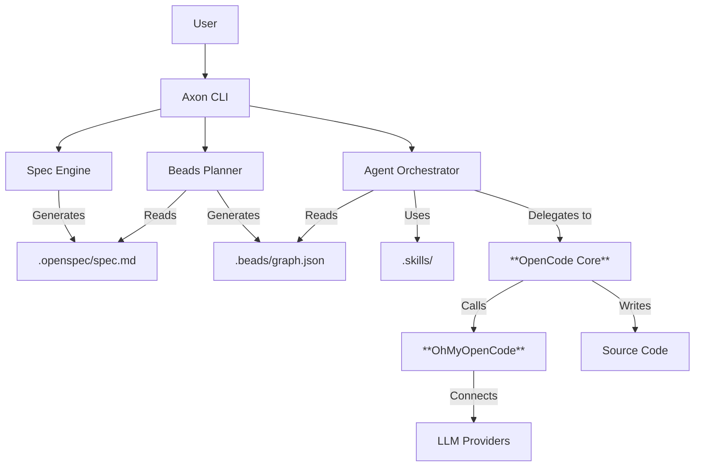

# Axon User Guide

> **AI-Powered Development Operating System**

Axon is a unified AI-assisted development environment designed to solve the "context loss", "wheel reinvention", and "planning chaos" problems in AI programming. By deeply integrating **Specification-Driven Development (OpenSpec)**, **Task Management (Beads)**, and **Skill Reuse (FindSkills)**, Axon makes AI a true development partner rather than just a code completion tool.

---

## 🏗️ Design Philosophy

### The Problems We Solve

1.  **Context Amnesia**: Chat-based AI coding tools often forget long-term project architecture and decisions.
2.  **Wheel Reinvention**: Developers and AI keep rewriting the same authentication, database, or API logic without reusing established best practices.
3.  **Planning Chaos**: "Chat-to-Code" often leads to spaghetti code because there is no rigorous "Plan before Act" phase.

### Our Solution

Axon is an orchestration layer built upon the powerful **OpenCode** agentic engine and the **OhMyOpenCode (OMO)** provider system. It introduces a **Spec-Plan-Execute-Verify** loop:
1.  **Spec**: Define *what* you want (Requirements).
2.  **Plan**: Break it down into atomic tasks (Beads).
3.  **Execute**: **OpenCode** agents implement tasks one by one, using **OMO** for LLM access.
4.  **Verify**: Human review and automated checks.

Axon supports two primary operation modes:
- **Autonomous Flow**: Using `ax flow run` for non-IDE or fully automated environments.
- **IDE Integrated**: Using `ax mcp` to empower IDEs (Cursor/Trae) with Axon's planning and context tools.

---

## 🏛️ System Architecture

Axon acts as the "Brain" (Planning & Context) while **OpenCode** acts as the "Hands" (Coding & Execution).



### Core Components

*   **OpenSpec**: A markdown-based format for defining software specifications.
*   **Beads**: A task graph system that breaks complex features into small, manageable units of work (beads).
*   **OpenCode**: The underlying agentic engine that performs the actual coding work for each bead.
*   **OhMyOpenCode (OMO)**: The universal LLM provider middleware that powers Axon, supporting 75+ providers (Anthropic, OpenAI, etc.).
*   **Skills**: A library of reusable prompts and code templates. Axon supports multiple skill directory conventions:
    - `.skills/`: Local project-specific skills (configured in `.axon/config.yaml`).
    - `.agents/skills/`: Universal skills following the OpenCode/Official convention.
    - `.agent/skills/`: Skills following the Antigravity agent convention.
    - `~/.axon/skills/`: User-wide global skills.

---

## 🚀 QUICK START

### Greenfield (CLI / CI)

```bash
ax init my-project
cd my-project
ax flow run --work all --skills suggest
ax status
```

### Existing repo adoption

```bash
cd existing-repo
ax init .
ax docs add-dir ./docs
ax plan
ax work
```

### IDE workflow (MCP)

```bash
ax mcp --llm off   # IDE owns the LLM (recommended)
ax mcp --llm auto  # Axon runs LLM calls for flow/work tools
```

### Troubleshooting: “No executable tasks”

```bash
ax status --beads
ax work --bead <bead-id>  # re-run a failed task
ax plan                   # regenerate graph if dependencies are wrong
```

---

## 🧩 Basic Features (基本功能说明)

### Spec (OpenSpec)
- Source of truth: `.openspec/spec.md`
- Commands: `ax spec init`, `ax spec analyze`, `ax spec edit`, `ax spec show`

### Plan (Beads graph)
- Output: `.beads/graph.json` (DAG of tasks)
- Command: `ax plan`

### Work (Execute beads)
- Commands: `ax work`, `ax work --all`, `ax work --bead <id>`
- Diagnostics: `ax status` / `ax status --beads`
- Git safety: blocks risky runs on dirty trees / protected branches

### Flow (End-to-end)
- Command: `ax flow run`
- Stages: spec → prd → tech → design → plan → work → checks → verify
- Outputs: `PRD.md`, `TECH.md`, `ARCHITECTURE.md`, `VERIFY.md`

### MCP (IDE integration)
- Command: `ax mcp --llm off|auto`
- Use-case: let IDE call `axon.*` tools to keep specs/plans/artifacts consistent

### Verify (Quality)
- `run_checks` runs configured commands (e.g. `bun test`, `bun run type-check`)
- `verify_requirements` generates `VERIFY.md` from spec/PRD/graph/checks

### Skills (Reusable expertise)
- Paths: `.skills/`, `.agents/skills/`, `.agent/skills/`, global skills
- Commands: `ax skills search`, `ax skills install`, `axon.skills_add/update` (via MCP)

### Docs (Context library)
- Commands: `ax docs add`, `ax docs add-dir`, `ax docs search`, `ax docs show`

---

## 🔗 More
- Project overview: [README.md](file:///Users/zhh/Axon-Projects/axon/README.md)
- Workflow playbooks: [2026-02-10-workflow-playbooks.md](file:///Users/zhh/Axon-Projects/axon/docs/plans/2026-02-10-workflow-playbooks.md)
- Release notes: [CHANGELOG.md](file:///Users/zhh/Axon-Projects/axon/CHANGELOG.md)
