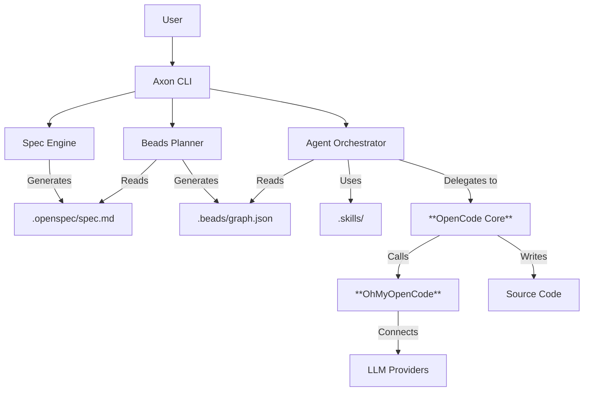

# Axon User Guide

> **AI-Powered Development Operating System**

Axon is a unified AI-assisted development environment designed to solve the "context loss", "wheel reinvention", and "planning chaos" problems in AI programming. By deeply integrating **Specification-Driven Development (OpenSpec)**, **Task Management (Beads)**, and **Skill Reuse (FindSkills)**, Axon makes AI a true development partner rather than just a code completion tool.

---

## 🏗️ Design Philosophy

### The Problems We Solve

1.  **Context Amnesia**: Chat-based AI coding tools often forget long-term project architecture and decisions.
2.  **Wheel Reinvention**: Developers and AI keep rewriting the same authentication, database, or API logic without reusing established best practices.
3.  **Planning Chaos**: "Chat-to-Code" often leads to spaghetti code because there is no rigorous "Plan before Act" phase.

### Our Solution

Axon is an orchestration layer built upon the powerful **OpenCode** agentic engine and the **OhMyOpenCode (OMO)** provider system. It introduces a **Spec-Plan-Execute-Verify** loop:
1.  **Spec**: Define *what* you want (Requirements).
2.  **Plan**: Break it down into atomic tasks (Beads).
3.  **Execute**: **OpenCode** agents implement tasks one by one, using **OMO** for LLM access.
4.  **Verify**: Human review and automated checks.

---

## 🏛️ System Architecture

Axon acts as the "Brain" (Planning & Context) while **OpenCode** acts as the "Hands" (Coding & Execution).



### Core Components

*   **OpenSpec**: A markdown-based format for defining software specifications.
*   **Beads**: A task graph system that breaks complex features into small, manageable units of work (beads).
*   **OpenCode**: The underlying agentic engine that performs the actual coding work for each bead.
*   **OhMyOpenCode (OMO)**: The universal LLM provider middleware that powers Axon, supporting 75+ providers (Anthropic, OpenAI, etc.).
*   **Skills**: A library of reusable prompts and code templates.

---

## ✨ Key Features

### 1. Specification-First Development
Instead of jumping into code, `ax spec init` helps you clarify your requirements through an interactive interview with AI. This generates a `spec.md` that serves as the single source of truth.

### 2. Intelligent Task Planning
`ax plan` analyzes your specification and breaks it down into a dependency graph of tasks.
*   **Atomic**: Each task is small enough to be completed reliably by AI.
*   **Ordered**: Tasks are sorted by dependencies (e.g., "Create DB Schema" before "Create API").
*   **Visual**: You can visualize the plan before execution.

### 3. Agentic Execution
`ax work` executes the planned tasks.
*   **Context-Aware**: The agent knows the current task, the overall spec, and the project structure.
*   **Safe**: Changes are committed to Git after each task.
*   **Recoverable**: If a task fails, you can retry it without restarting the whole project.

### 4. Skill Injection
Axon searches your local `.skills` directory and the global library for relevant patterns. If you are building an API, it pulls in your team's standard API response wrapper skill.

### 5. Document Integration
Import existing project documents (PDF, Word, Markdown) into Axon's context. AI agents will use these documents to better understand requirements, constraints, and architecture during spec generation and task execution.

### 5. Config Priority & Safety
*   **Config Priority**: CLI Args > Project Config > OMO Config > Environment Variables.
*   **Git Safety**: Prevents execution on dirty working trees and warns before committing to protected branches (`main`/`master`).

---

## 🚀 Tutorial: Building a REST API

Let's walk through a real-world scenario: **Building a simple User API with Hono.**

### Step 1: Initialize Project
Create a standard Axon project structure.

```bash
ax init my-user-api
cd my-user-api
```

### Step 2: Define Requirements (Spec)
Tell Axon what you want to build.

```bash
ax spec init
```

*Axon will ask:* "What are you building?"
*You allow:* "A Hono-based REST API with a `GET /users` endpoint that returns a list of mock users."

Axon generates `.openspec/spec.md`:
```markdown
# User API Specification
## Requirements
1.  **Server**: Use Hono framework.
2.  **API**: Implement `GET /users` returning JSON array.
3.  **Data**: Use in-memory mock data.
```

### Step 3: Generate Plan (Plan)
Convert the spec into executable tasks.

```bash
ax plan
```

Axon analyzes the spec and creates `.beads/graph.json`:
1.  **Setup Hono**: Install dependencies (`hono`, `tsx`).
2.  **Create Server**: Implement basic server structure.
3.  **Implement Route**: Add `GET /users` handler.

### Step 4: Execute (Work)
Let the AI agents build it.

```bash
ax work
```

*   **Agent** picks up "Setup Hono".
*   **Agent** runs `npm install hono`.
*   **Axon** commits: "✅ setup: Install Hono".
*   **Agent** picks up "Create Server".
*   **Agent** writes `src/index.ts`.
*   **Axon** commits: "✅ feature: Basic server setup".

### Step 5: Verify
Run the generated code.

```bash
bun start
# Server running on http://localhost:3000
```

---

## 👥 Team Collaboration

Axon is designed with a "Documentation-as-Code" philosophy, making it naturally compatible with Git-based workflows.

### 1. Git as the Single Source of Truth
To collaborate, ensure the following directories are committed to your repository:
*   `.openspec/`: Keeps the team aligned on requirements.
*   `.beads/`: Acts as the team's live "Task Board".
*   `.skills/`: Shares high-quality code patterns and prompts across the team.

### 2. Configuration Strategy
*   **Shared Logic (`.axon/config.yaml`)**: Commit this to Git to define project models and safety rules.
*   **Personal Credentials**: Use environment variables (`ANTHROPIC_API_KEY`) or OMO for personal API keys. Axon combines shared logic with local credentials automatically.

### 3. Recommended .gitignore
Add the following to your project's `.gitignore`:
```gitignore
# Runtime logs
.axon/logs/
dist/

# Keep these in Git
!.axon/config.yaml
!.openspec/
!.beads/
!.skills/
```

### 4. Collaboration Workflow
1.  **Lead**: Runs `ax spec init` and `ax plan`, then pushes to Git.
2.  **Devs**: Pull the repo, check progress via `ax status`, and pick tasks.
3.  **Execution**: Devs run `ax work` to complete tasks. Axon generates atomic commits linked to Bead IDs.
4.  **Review**: Reviewers use Bead IDs to trace code changes back to the original spec requirement.

---

## 👥 团队协作

Axon 采用“文档即代码”的设计理念，使其天然兼容基于 Git 的协作流程。

### 1. 以 Git 作为“单一真理来源”
为了进行协作，请确保将以下目录提交到 Git 仓库：
*   `.openspec/`: 确保团队对需求的理解保持一致。
*   `.beads/`: 充当团队的实时“任务看板”。
*   `.skills/`: 在团队内共享高质量的代码模式和提示词模板。

### 2. 配置策略
*   **共享逻辑 (`.axon/config.yaml`)**: 提交此文件以定义项目模型和安全规则。
*   **个人凭据**: 使用环境变量 (`ANTHROPIC_API_KEY`) 或 OMO 管理个人 API 密钥。Axon 会自动将共享逻辑与本地凭据结合使用。

### 3. 推荐的 .gitignore
在项目 `.gitignore` 中添加以下内容：
```gitignore
# 运行日志
.axon/logs/
dist/

# 必须保留在 Git 中
!.axon/config.yaml
!.openspec/
!.beads/
!.skills/
```

### 4. 协同工作流
1.  **负责人**: 运行 `ax spec init` 和 `ax plan`，然后推送到 Git。
2.  **开发者**: 拉取仓库，通过 `ax status` 查看进度并领取任务。
3.  **执行**: 开发者运行 `ax work` 完成任务。Axon 会生成与 Bead ID 关联的原子提交。
4.  **评审**: 评审人通过 Bead ID 将代码改动追溯到原始规格需求。

---

## 🆚 与同类工具对比Comparison with Other Tools

| Feature | Axon | GitHub Copilot / Cursor | Aider / OpenDevin |
| :--- | :--- | :--- | :--- |
| **Core Philosophy** | **Plan-Execute-Verify** (Agentic) | **Autocomplete** (Assistive) | **Chat-to-Code** (Autonomous) |
| **Context Awareness** | **High** (Project-wide Spec + Graph) | **Medium** (Open Files + RAG) | **High** (Repo Map) |
| **Planning** | ✅ **Explicit Task Graph** | ❌ None (Streaming) | ⚠️ Implicit (Step-by-step) |
| **Human Control** | ✅ **High** (Review Plan & Spec) | ✅ High (Accept/Reject) | ⚠️ Application Dependent |
| **Cost Control** | ✅ **Token Budgeting & Tracking** | ❌ Subscription Based | ⚠️ Often Unbounded |
| **Knowledge Reuse** | ✅ **Skill Templates** (.skills) | ❌ None | ❌ None |

---

## 📚 Document Management

Axon allows you to import external documents to provide context for AI agents. This is crucial for ensuring the AI understands your specific business rules, legacy architecture, or detailed product requirements.

### Supported Formats
- **Markdown (.md)**: Best for technical docs.
- **Word (.docx)**: Requirements documents, PRDs.
- **PDF (.pdf)**: Legacy specifications, extensive manuals.
- **Text & Code (.txt, .yaml, etc.)**: Config files, logs.

### Context Workflow
1.  **Import**: Add documents to the library.
2.  **Indexing**: Axon extracts text and uses AI to generate metadata (summary, tags).
3.  **Usage**: 
    - `ax spec init` automatically detects documents and asks to use them.
    - `ax work` agents can search and reference these documents during coding.

### Managing Documents

```bash
# Add a single file
ax docs add ./docs/PRD_v1.0.docx --title "Product Requirements"

# Add an entire directory
ax docs add-dir ./legacy-docs/

# List all documents
ax docs list

# Search content
ax docs search "authentication"

# View details
ax docs show <doc-id>
```

---

## 📚 API & Command Reference

### Core Commands

| Command | Description |
| :--- | :--- |
| `ax init [name]` | Initialize a new Axon project with standard structure. |
| `ax spec init` | Interactively create a project specification (`.openspec/spec.md`). |
| `ax spec edit` | Edit the existing project specification in your default text editor. |
| `ax spec show` | Display the current specification. |
| `ax plan` | Generate a task graph (`.beads/graph.json`) from the specification. |
| `ax work` | Execute pending tasks in the graph. |
| `ax work --interactive` | Execute tasks with manual confirmation for each step. |
| `ax status` | detailed project progress and bead status. |

### Configuration Commands

| Command | Description |
| :--- | :--- |
| `ax config list` | List available LLM providers and models. |
| `ax config show` | Show the current resolved configuration. |
| `ax config setup` | Interactive wizard to setup LLM provider. |

### Skill Commands

| Command | Description |
| :--- | :--- |
| `ax skills search <query>` | Search for available skills. |
| `ax skills add <path>` | Import a skill into the project. |

### Utility Commands

| Command | Description |
| :--- | :--- |
| `ax doctor` | Diagnose environment issues (Node version, tool install, keys). |
| `ax doctor --fix` | Attempt to automatically fix diagnosed issues. |

### Document Commands

| Command | Description |
| :--- | :--- |
| `ax docs add <path>` | Import a document. |
| `ax docs add-dir <path>` | Import all documents from a directory. |
| `ax docs list` | List indexed documents. |
| `ax docs search <query>` | Search within documents. |
| `ax docs show <id>` | View document metadata and content. |
| `ax docs summarize <id>` | Generate AI summary for a document. |

---

## ⚙️ Configuration Reference

Axon uses a hierarchical configuration system.

### File: `.axon/config.yaml`
```yaml
project:
  name: "my-project"
agents:
  sisyphus:
    model: "claude-3-5-sonnet-20240620"
    provider: "anthropic"
    temperature: 0.5
safety:
  daily_token_limit: 1000000
  auto_commit: true
```

### Environment Variables
*   `ANTHROPIC_API_KEY`: Fallback key if no OMO provider is configured.
*   `OPENAI_API_KEY`, etc.: Used by OMO providers.
