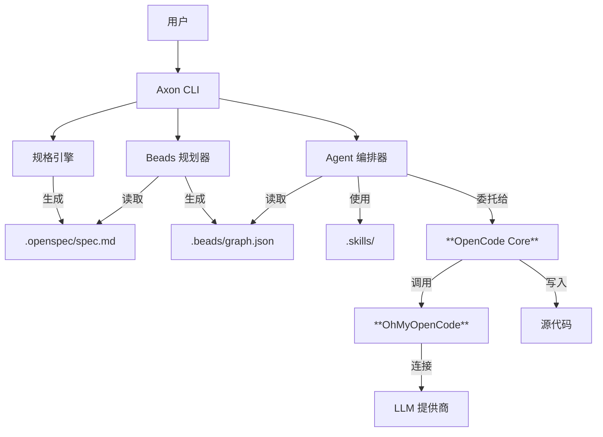

# Axon 用户指南

> **AI 驱动的开发操作系统**

Axon 是一个统一的 AI 辅助开发环境，旨在解决 AI 编程中的“上下文丢失”、“重复造轮子”和“规划失控”问题。通过深度集成 **规格驱动开发 (OpenSpec)**、**任务管理 (Beads)** 和 **技能复用 (FindSkills)**，Axon 让 AI 真正成为你的开发伙伴，而不仅仅是一个代码补全工具。

---

## 🏗️ 设计理念

### 我们解决的问题

1.  **上下文遗忘**：基于对话的 AI 编程工具往往会忘记长期的项目架构和决策。
2.  **重复造轮子**：开发者和 AI 不断重写相同的认证、数据库或 API 逻辑，无法复用已有的最佳实践。
3.  **规划混乱**：“对话即代码”模式往往通过“走一步看一步”的方式生成代码，缺乏严谨的“先规划后行动”阶段，容易导致代码结构混乱。

### 我们的解决方案

Axon 是构建在强大的 **OpenCode** 智能体引擎和 **OhMyOpenCode (OMO)** 提供商系统之上的编排层。它引入了 **规格-规划-执行-验证** 循环：
1.  **规格 (Spec)**：定义你想要 *什么* (需求)。
2.  **规划 (Plan)**：将其拆解为原子的任务 (Beads)。
3.  **执行 (Execute)**：**OpenCode** 智能体使用 **OMO** 访问 LLM，逐个执行任务。
4.  **验证 (Verify)**：人类审查和自动化检查。

---

## 🏛️ 系统架构

Axon 充当“大脑”（规划与上下文），而 **OpenCode** 充当“双手”（编码与执行）。



### 核心组件

*   **OpenSpec**: 用于定义软件规格的 Markdown 格式。
*   **Beads**: 任务图系统，将复杂功能分解为小的、可管理的任务单元 (珠子)。
*   **OpenCode**: 执行每个珠子实际编码工作的底层智能体引擎。
*   **OhMyOpenCode (OMO)**: 为 Axon 提供动力的通用 LLM 提供商中间件，支持 75+ 提供商。
*   **Skills**: 可复用的提示词和代码模板库。Axon 支持多种技能目录规范：
    - `.skills/`: 项目本地技能（在 `.axon/config.yaml` 中配置）。
    - `.agents/skills/`: 遵循 OpenCode/官方规范的通用技能。
    - `.agent/skills/`: 遵循 Antigravity 智能体规范的技能。
    - `~/.axon/skills/`: 用户级别的全局技能。

---

## ✨ 核心特性

### 1. 规格驱动开发 (Spec-First)
拒绝直接开始写代码。`ax spec init` 通过与 AI 进行交互式访谈，帮助你理清需求。这会生成一个 `spec.md` 文件，作为项目的“单一真理来源”。

### 2. PRD 深度优化
使用 `ax spec analyze` 将你的初步想法转化为专业、结构化的产品需求文档 (`PRD.md`)。此过程会利用专家技能（如 `brainsstorm`）来确保架构和业务逻辑的严密性。

### 3. 智能任务规划
`ax plan` 分析你的规格说明，并将其拆解为任务依赖图。
*   **原子化 (Atomic)**: 每个任务都足够小，可以由 AI 可靠地完成。
*   **有序性 (Ordered)**: 任务按依赖关系排序（例如，“创建数据库架构”必须在“创建 API”之前）。
*   **专家知识**: 将本地技能（如 `write-plan`）集成到规划提示词中。
*   **可视化**: 你可以在执行前预览并调整规划。

### 4. 代理式执行
`ax work` 执行规划好的任务。
*   **上下文感知**: 代理知道当前任务、整体规格和项目结构。
*   **安全性**: 每个任务完成后都会自动提交到 Git。
*   **可恢复性**: 如果某个任务失败，你可以重试该任务，而无需重启整个项目。

### 5. 技能编排 (Orchestration)
Axon 会在初始化时自动检测你的技术栈，并建议相关的专家技能。你可以使用 `ax skills install --symlink` 来集中化地采纳全局最佳实践。

### 6. 文档集成
使用 `ax docs add-dir` 批量导入整个目录。AI 代理将利用这些文档在规格生成和任务执行期间更好地理解背景信息。

### 6. 配置优先级与安全
*   **配置优先级**: CLI 参数 > 项目配置 > OMO 配置 > 环境变量。
*   **Git 安全**: 防止在不干净的工作区执行任务，并在向保护分支 (`main`/`master`) 提交前发出警告。

---

## 🚀 教程：构建一个 REST API

让我们演练一个真实场景：**使用 Hono 构建一个简单的用户 API。**

### 第一步：初始化项目
创建标准的 Axon 项目结构。

```bash
ax init my-user-api
cd my-user-api
```

### 第二步：定义需求 (Spec)
告诉 Axon 你想要构建什么。

```bash
ax spec init
```

*Axon 提问:* "你想构建什么项目？"
*你回答:* "一个基于 Hono 的 REST API，包含 `GET /users` 端点，返回模拟用户列表。"

Axon 生成 `.openspec/spec.md`:
```markdown
# User API 规格说明
## 需求
1.  **服务器**: 使用 Hono 框架。
2.  **API**: 实现 `GET /users` 返回 JSON 数组。
3.  **数据**: 使用内存模拟数据。
```

### 第三步：生成规划 (Plan)
将规格转换为可执行任务。

```bash
ax plan
```

Axon 分析规格并创建 `.beads/graph.json`:
1.  **Setup Hono**: 安装依赖 (`hono`, `tsx`)。
2.  **Create Server**: 实现基础服务器结构。
3.  **Implement Route**: 添加 `GET /users` 处理函数。

### 第四步：执行 (Work)
让 AI 代理开始构建。

```bash
ax work
```

*   **智能体** 领取任务 "Setup Hono"。
*   **智能体** 运行 `npm install hono`。
*   **Axon** 提交代码: "✅ setup: Install Hono"。
*   **智能体** 领取任务 "Create Server"。
*   **智能体** 编写 `src/index.ts`。
*   **Axon** 提交代码: "✅ feature: Basic server setup"。

### 第五步：验证
运行生成的代码。

```bash
bun start
# Server running on http://localhost:3000
```

---

## 👥 团队协作

Axon 采用“文档即代码”的设计理念，使其天然兼容基于 Git 的协作流程。

### 1. 以 Git 作为“单一真理来源”
为了进行协作，请确保将以下目录提交到 Git 仓库：
*   `.openspec/`: 确保团队对需求的理解保持一致。
*   `.beads/`: 充当团队的实时“任务看板”。
*   `.skills/`: 在团队内共享高质量的代码模式和提示词模板。

### 2. 配置策略
*   **共享逻辑 (`.axon/config.yaml`)**: 提交此文件以定义项目模型和安全规则。
*   **个人凭据**: 使用环境变量 (`ANTHROPIC_API_KEY`) 或 **OhMyOpenCode (OMO)** 管理个人 API 密钥。Axon 会自动从本地 OMO 配置和 Antigravity 认证（`~/.config/opencode/antigravity-accounts.json`）中解析凭据，在不泄露私钥的情况下驱动企业级代理。Axon 将这些本地凭据与共享的项目逻辑在运行时自动结合。

### 3. 推荐的 .gitignore
在项目 `.gitignore` 中添加以下内容：
```gitignore
# 运行日志
.axon/logs/
dist/

# 必须保留在 Git 中
!.axon/config.yaml
!.openspec/
!.beads/
!.skills/
```

### 4. 协同工作流
1.  **负责人**: 运行 `ax spec init` 和 `ax plan`，然后推送到 Git。
2.  **开发者**: 拉取仓库，通过 `ax status` 查看进度并领取任务。
3.  **执行**: 开发者运行 `ax work` 完成任务。Axon 会生成与 Bead ID 关联的原子提交。
4.  **评审**: 评审人通过 Bead ID 将代码改动追溯到原始规格需求。

---

## 🆚 与同类工具对比

| 特性 | Axon | GitHub Copilot / Cursor | Aider / OpenDevin |
| :--- | :--- | :--- | :--- |
| **核心理念** | **规划-执行-验证** (代理式) | **自动补全** (辅助式) | **聊天即代码** (自主式) |
| **上下文感知** | **高** (全项目规格 + 任务图) | **中** (打开文件 + RAG) | **高** (仓库地图) |
| **规划能力** | ✅ **显式任务图** | ❌ 无 (流式生成) | ⚠️ 隐式 (逐步进行) |
| **人类控制** | ✅ **高** (审查规划与规格) | ✅ 高 (接受/拒绝) | ⚠️ 依赖于具体应用 |
| **成本控制** | ✅ **Token 预算与追踪** | ❌ 基于订阅 | ⚠️ 通常无限制 |
| **知识复用** | ✅ **技能模板** (.skills) | ❌ 无 | ❌ 无 |

---

## 📚 文档管理

Axon 允许你导入外部文档，为 AI 智能体提供上下文。这对于确保 AI 理解你的具体业务规则、遗留架构或详细的产品需求至关重要。

### 支持的格式
- **Markdown (.md)**: 技术文档的最佳选择。
- **Word (.docx)**: 需求文档、PRD。
- **PDF (.pdf)**: 遗留规格说明书、大量手册。
- **文本与代码 (.txt, .yaml 等)**: 配置文件、日志。

### 上下文工作流
1.  **导入**: 将文档添加到库中。
2.  **索引**: Axon 提取文本并使用 AI 生成元数据（摘要、标签）。
3.  **使用**: 
    - `ax spec init` 自动检测文档并询问是否使用。
    - `ax work` 智能体可以在编码过程中搜索并引用这些文档。

### 管理文档

```bash
# 添加单个文件
ax docs add ./docs/PRD_v1.0.docx --title "产品需求文档"

# 添加整个目录
ax docs add-dir ./legacy-docs/

# 列出所有文档
ax docs list

# 搜索内容
ax docs search "认证"

# 查看详情
ax docs show <doc-id>
```

---

## 📚 API 与命令参考

### 核心命令

| 命令 | 描述 |
| :--- | :--- |
| `ax init [name]` | 初始化新的 Axon 项目，包含结构创建和技术栈检测。 |
| `ax spec init` | 交互式地创建项目规格 (`.openspec/spec.md`)。 |
| `ax spec analyze` | 将规格文档转化为专业的 `PRD.md`。 |
| `ax spec edit` | 在默认编辑器中编辑现有项目规格。 |
| `ax spec show` | 显示当前规格文档。 |
| `ax plan` | 使用专家技能从规格生成任务图 (`.beads/graph.json`)。 |
| `ax work` | 执行图中的待办任务。 |
| `ax work --interactive` | 以手动确认模式执行任务。 |
| `ax status` | 查看详细的项目进度和 Bead 状态。 |

### 配置命令

| 命令 | 描述 |
| :--- | :--- |
| `ax config list` | 列出可用的 LLM 提供商和模型。 |
| `ax config show` | 显示当前解析后的配置。 |
| `ax config setup` | 设置 LLM 提供商的交互式向导。 |
| `ax config test` | 测试 LLM 连接是否正常。 |

### `ax config test`

测试 LLM 连接是否正常。

```bash
ax config test
ax config test --provider antigravity
ax config test --model gpt-4o
ax config test --mode direct  # 强制使用直接 API 模式
```

参数：
- `-p, --provider <name>`: 指定要测试的 Provider。
- `-m, --model <model>`: 指定测试使用的模型。
- `--mode <mode>`: 强制使用的模式 (`cli`, `direct`, `fallback`)。

### 技能命令

| 命令 | 描述 |
| :--- | :--- |
| `ax skills search <query>` | 搜索可用的技能。 |
| `ax skills install <name>` | 安装或链接技能到本项目。 |

### 工具命令

| 命令 | 描述 |
| :--- | :--- |
| `ax doctor` | 诊断环境问题（Node 版本、工具安装、密钥）。 |
| `ax doctor --fix` | 尝试自动修复诊断出的问题。 |

### 文档命令

| 命令 | 描述 |
| :--- | :--- |
| `ax docs add <path>` | 导入文档。 |
| `ax docs add-dir <path>` | 导入目录下的所有文档。 |
| `ax docs list` | 列出已索引的文档。 |
| `ax docs search <query>` | 在文档内搜索。 |
| `ax docs show <id>` | 查看文档元数据和内容。 |
| `ax docs summarize <id>` | 生成文档的 AI 摘要。 |

---

## ⚙️ 配置参考

Axon 使用层级配置系统。

### 文件: `.axon/config.yaml`
```yaml
project:
  name: "my-project"
agents:
  sisyphus:
    model: "claude-3-5-sonnet-20240620"
    provider: "anthropic"
    temperature: 0.5
safety:
  daily_token_limit: 1000000
  auto_commit: true
```

### 环境变量
*   `ANTHROPIC_API_KEY`: 如果未配置 OMO 提供商，则作为回退密钥。
*   `OPENAI_API_KEY` 等: OMO 提供商使用。
