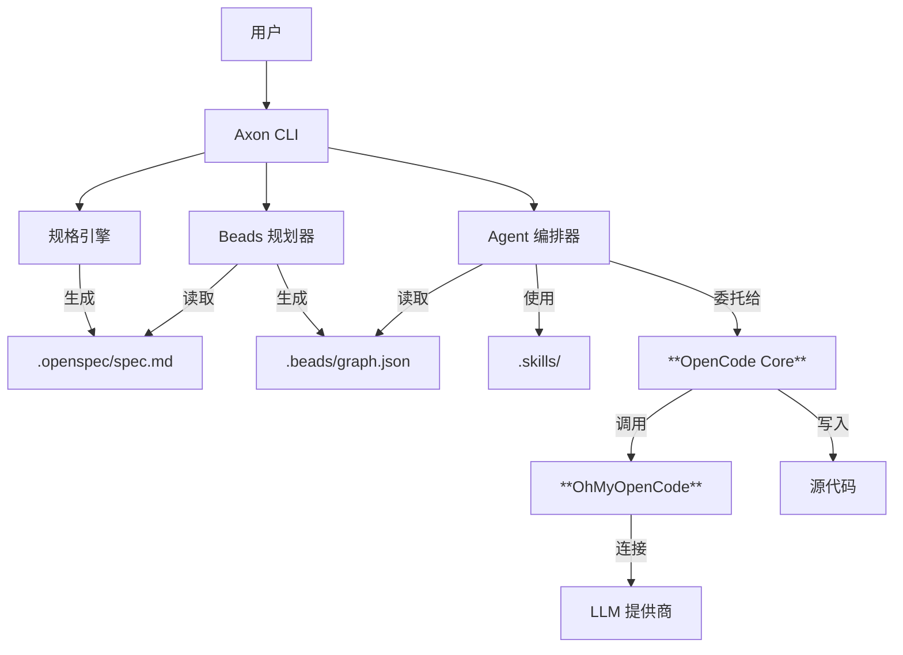

# Axon 用户指南

> **AI 驱动的开发操作系统**

Axon 是一个统一的 AI 辅助开发环境，旨在解决 AI 编程中的“上下文丢失”、“重复造轮子”和“规划失控”问题。通过深度集成 **规格驱动开发 (OpenSpec)**、**任务管理 (Beads)** 和 **技能复用 (FindSkills)**，Axon 让 AI 真正成为你的开发伙伴，而不仅仅是一个代码补全工具。

---

## 🏗️ 设计理念

### 我们解决的问题

1.  **上下文遗忘**：基于对话的 AI 编程工具往往会忘记长期的项目架构和决策。
2.  **重复造轮子**：开发者和 AI 不断重写相同的认证、数据库或 API 逻辑，无法复用已有的最佳实践。
3.  **规划混乱**：“对话即代码”模式往往通过“走一步看一步”的方式生成代码，缺乏严谨的“先规划后行动”阶段，容易导致代码结构混乱。

### 我们的解决方案

Axon 是构建在强大的 **OpenCode** 智能体引擎和 **OhMyOpenCode (OMO)** 提供商系统之上的编排层。它引入了 **规格-规划-执行-验证** 循环：
1.  **规格 (Spec)**：定义你想要 *什么* (需求)。
2.  **规划 (Plan)**：将其拆解为原子的任务 (Beads)。
3.  **执行 (Execute)**：**OpenCode** 智能体使用 **OMO** 访问 LLM，逐个执行任务。
4.  **验证 (Verify)**：人类审查和自动化检查。

---

## 🏛️ 系统架构

Axon 充当“大脑”（规划与上下文），而 **OpenCode** 充当“双手”（编码与执行）。



### 核心组件

*   **OpenSpec**: 用于定义软件规格的 Markdown 格式。
*   **Beads**: 任务图系统，将复杂功能分解为小的、可管理的任务单元 (珠子)。
*   **OpenCode**: 执行每个珠子实际编码工作的底层智能体引擎。
*   **OhMyOpenCode (OMO)**: 为 Axon 提供动力的通用 LLM 提供商中间件，支持 75+ 提供商。
*   **Skills**: 可复用的提示词和代码模板库。

---

## ✨ 核心特性

### 1. 规格优先开发 (Specify First)
`ax spec init` 通过与 AI 的交互式访谈帮助你理清需求，而不是直接开始写代码。这会生成一份 `spec.md`，作为项目的唯一真理来源。

### 2. 智能任务规划
`ax plan` 分析你的规格文档，并将其分解为任务依赖图。
*   **原子性**: 每个任务都足够小，AI 可以可靠地完成。
*   **有序性**: 任务按依赖关系排序 (例如：先“创建数据库 Schema”，再“创建 API”)。
*   **可视化**: 执行前可以可视化查看规划。

### 3. 代理式执行
`ax work` 执行已规划的任务。
*   **上下文感知**: 代理知道当前任务、整体规格和项目结构。
*   **安全**: 每个任务完成后自动提交到 Git。
*   **可恢复**: 如果某个任务失败，你可以只重试该任务，无需重启整个项目。

### 4. 技能注入
Axon 会在你的本地 `.skills` 目录和全局库中搜索相关模式。如果你正在构建 API，它会自动拉取团队标准的 API 响应包装器技能。

### 5. 配置优先级与安全
*   **配置优先级**: CLI 参数 > 项目配置 > OMO 配置 > 环境变量。
*   **Git 安全**: 防止在不干净的工作区执行任务，并在向保护分支 (`main`/`master`) 提交前发出警告。

---

## 🆚 与同类工具对比

| 特性 | Axon | GitHub Copilot / Cursor | Aider / OpenDevin |
| :--- | :--- | :--- | :--- |
| **核心理念** | **规划-执行-验证** (代理式) | **自动补全** (辅助式) | **聊天即代码** (自主式) |
| **上下文感知** | **高** (全项目规格 + 任务图) | **中** (打开文件 + RAG) | **高** (仓库地图) |
| **规划能力** | ✅ **显式任务图** | ❌ 无 (流式生成) | ⚠️ 隐式 (逐步进行) |
| **人类控制** | ✅ **高** (审查规划与规格) | ✅ 高 (接受/拒绝) | ⚠️ 依赖于具体应用 |
| **成本控制** | ✅ **Token 预算与追踪** | ❌ 基于订阅 | ⚠️ 通常无限制 |
| **知识复用** | ✅ **技能模板** (.skills) | ❌ 无 | ❌ 无 |

---

## 📚 API 与命令参考

### 核心命令

| 命令 | 描述 |
| :--- | :--- |
| `ax init [name]` | 初始化标准结构的 Axon 项目。 |
| `ax spec init` | 交互式创建项目规格 (`.openspec/spec.md`)。 |
| `ax spec show` | 显示当前规格。 |
| `ax plan` | 从规格生成任务图 (`.beads/graph.json`)。 |
| `ax work` | 执行图中的待处理任务。 |
| `ax work --interactive` | 以交互模式执行任务（每一步需确认）。 |
| `ax status` | 查看详细的项目进度和任务状态。 |

### 配置命令

| 命令 | 描述 |
| :--- | :--- |
| `ax config list` | 列出可用的 LLM 提供商和模型。 |
| `ax config show` | 显示当前解析后的配置。 |
| `ax config setup` | 设置 LLM 提供商的交互式向导。 |

### 技能命令

| 命令 | 描述 |
| :--- | :--- |
| `ax skills search <query>` | 搜索可用技能。 |
| `ax skills add <path>` | 将技能导入项目。 |

### 工具命令

| 命令 | 描述 |
| :--- | :--- |
| `ax doctor` | 诊断环境问题（Node 版本、工具安装、密钥）。 |
| `ax doctor --fix` | 尝试自动修复诊断出的问题。 |

---

## ⚙️ 配置参考

Axon 使用层级配置系统。

### 文件: `.axon/config.yaml`
```yaml
project:
  name: "my-project"
agents:
  sisyphus:
    model: "claude-3-5-sonnet-20240620"
    provider: "anthropic"
    temperature: 0.5
safety:
  daily_token_limit: 1000000
  auto_commit: true
```

### 环境变量
*   `ANTHROPIC_API_KEY`: 如果未配置 OMO 提供商，则作为回退密钥。
*   `OPENAI_API_KEY` 等: OMO 提供商使用。
