# Axon 用户指南

> **AI 驱动的开发操作系统**

Axon 是一个统一的 AI 辅助开发环境，旨在解决 AI 编程中的“上下文丢失”、“重复造轮子”和“规划失控”问题。通过深度集成 **规格驱动开发 (OpenSpec)**、**任务管理 (Beads)** 和 **技能复用 (FindSkills)**，Axon 让 AI 真正成为你的开发伙伴，而不仅仅是一个代码补全工具。

---

## 🏗️ 设计理念

### 我们解决的问题

1.  **上下文遗忘**：基于对话的 AI 编程工具往往会忘记长期的项目架构和决策。
2.  **重复造轮子**：开发者和 AI 不断重写相同的认证、数据库或 API 逻辑，无法复用已有的最佳实践。
3.  **规划混乱**：“对话即代码”模式往往通过“走一步看一步”的方式生成代码，缺乏严谨的“先规划后行动”阶段，容易导致代码结构混乱。

### 我们的解决方案

Axon 是构建在强大的 **OpenCode** 智能体引擎和 **OhMyOpenCode (OMO)** 提供商系统之上的编排层。它引入了 **规格-规划-执行-验证** 循环：
1.  **规格 (Spec)**：定义你想要 *什么* (需求)。
2.  **规划 (Plan)**：将其拆解为原子的任务 (Beads)。
3.  **执行 (Execute)**：**OpenCode** 智能体使用 **OMO** 访问 LLM，逐个执行任务。
4.  **验证 (Verify)**：人类审查和自动化检查。

Axon 支持两种核心运行模式：
- **全自动 Flow 模式**: 使用 `ax flow run` 在非 IDE 环境或全自动流水线中运行。
- **IDE 集成模式**: 使用 `ax mcp` 为 IDE (Cursor/Trae) 赋予 Axon 的规划、上下文与验证能力。

---

## 🏛️ 系统架构

Axon 充当“大脑”（规划与上下文），而 **OpenCode** 充当“双手”（编码与执行）。

```mermaid
graph TD
    User[用户] --> CLI[Axon CLI]
    CLI --> Spec[规格引擎]
    CLI --> Plan[Beads 规划器]
    CLI --> Exec[Agent 编排器]
    
    Spec -->|生成| OpenSpec[.openspec/spec.md]
    Plan -->|读取| OpenSpec
    Plan -->|生成| Graph[.beads/graph.json]
    
    Exec -->|读取| Graph
    Exec -->|使用| Skills[.skills/]
    Exec -->|委托给| OpenCode[**OpenCode Core**]
    
    OpenCode -->|调用| OMO[**OhMyOpenCode**]
    OMO -->|连接| LLM[LLM 提供商]
    
    OpenCode -->|写入| Code[源代码]
```



### 核心组件

*   **OpenSpec**: 用于定义软件规格的 Markdown 格式。
*   **Beads**: 任务图系统，将复杂功能分解为小的、可管理的任务单元 (珠子)。
*   **OpenCode**: 执行每个珠子实际编码工作的底层智能体引擎。
*   **OhMyOpenCode (OMO)**: 为 Axon 提供动力的通用 LLM 提供商中间件，支持 75+ 提供商。
*   **Skills**: 可复用的提示词和代码模板库。Axon 支持多种技能目录规范：
    - `.skills/`: 项目本地技能（在 `.axon/config.yaml` 中配置）。
    - `.agents/skills/`: 遵循 OpenCode/官方规范的通用技能。
    - `.agent/skills/`: 遵循 Antigravity 智能体规范的技能。
    - `~/.axon/skills/`: 用户级别的全局技能。

---

## 🚀 快速开始

### 新项目（CLI / CI）

```bash
ax init my-project
cd my-project
ax flow run --work all --skills suggest
ax status
```

### 在已有仓库中引入

```bash
cd existing-repo
ax init .
ax docs add-dir ./docs
ax plan
ax work
```

### IDE 工作流（MCP）

```bash
ax mcp --llm off   # IDE 托管 LLM（推荐）
ax mcp --llm auto  # Axon 运行 flow/work 的 LLM 调用
```

### 排查：没有可执行任务

```bash
ax status --beads
ax work --bead <bead-id>  # 重试失败任务
ax plan                   # 依赖关系不正确时，重生成任务图
```

### LLM 配置清单（最佳实践）

1. 选择模式：
   - **IDE 托管 LLM（推荐）**：`ax mcp --llm off`
   - **Axon 托管 LLM**：配置 OMO/OpenCode 后先运行 `ax config test`
2. 在长流程前先验证连通性：`ax config test --provider <p> --model <m>`
3. 将非敏感默认值固化到项目：`ax config set-model <model> -p <provider>`
4. 密钥不要进 Git：优先用 OMO 配置或环境变量；不要把 key 写进 `.axon/config.yaml`

---

## 🧩 基本功能说明

### Spec（OpenSpec）
- 单一真理来源：`.openspec/spec.md`
- 常用命令：`ax spec init`, `ax spec analyze`, `ax spec edit`, `ax spec show`

### Plan（Beads 任务图）
- 输出：`.beads/graph.json`（任务 DAG）
- 命令：`ax plan`

### Work（执行 beads）
- 常用命令：`ax work`, `ax work --all`, `ax work --bead <id>`
- 排查：`ax status` / `ax status --beads`
- Git 安全：阻止在不干净工作区 / 保护分支上进行高风险执行

### Flow（端到端闭环）
- 命令：`ax flow run`
- 阶段：spec → prd → tech → design → plan → work → checks → verify
- 产物：`PRD.md`, `TECH.md`, `ARCHITECTURE.md`, `VERIFY.md`

### MCP（IDE 集成）
- 命令：`ax mcp --llm off|auto`
- 用途：让 IDE 调用 `axon.*` 工具，保持规格/任务图/产物一致

### Verify（质量）
- `run_checks` 执行配置的检查命令（例如 `bun test`, `bun run type-check`）
- `verify_requirements` 基于 spec/PRD/graph/checks 生成 `VERIFY.md`

### Skills（可复用经验）
- 目录：`.skills/`, `.agents/skills/`, `.agent/skills/`，以及全局 skills
- 查找：`ax skills find [query]`（skills.sh 官方）/ `ax skills search <query>`（本地已安装）
- 安装与维护：`ax skills install <owner/repo@skill>`, `ax skills check`, `ax skills update`

### Docs（上下文库）
- 常用命令：`ax docs add`, `ax docs add-dir`, `ax docs search`, `ax docs show`

### Clean（清理）
- 常用命令：`ax clean --logs|--beads|--skills|--clutter|--all`

---

## 🔗 更多
- 项目概览：[README.md](../README.md)
- 工作流手册：[2026-02-10-workflow-playbooks.md](./plans/2026-02-10-workflow-playbooks.md)
- 发布记录：[CHANGELOG.md](../CHANGELOG.md)
